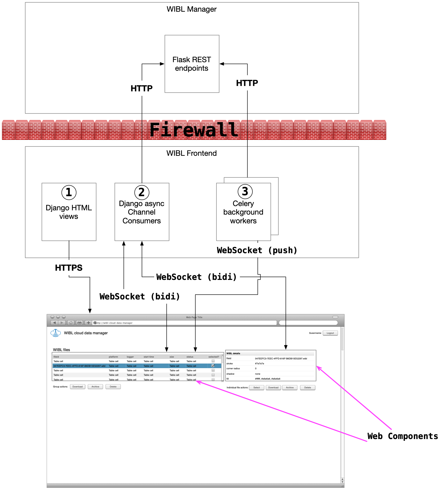

# WIBL Frontend
This directory contains a Django app and project for the WIBL Frontend application

## Running with `docker compose`
Use `docker compose up` to run while developing:
```shell
docker compose up --watch
```

> The `--watch` option will watch source code and rebuild/refresh containers when files are updated.

To re-build container images after major changes (e.g., addition of dependencies), run:
```shell
docker compose build
```

### Load test data into the manager 
Once the frontend is running via `docker compose`, you can load test data into the manager (so that the frontend will 
have some initial data to display/manipulate) by running:
```shell
docker compose exec manager /usr/src/wibl/load-test-data.bash
```

> Note: This script is idempotent so it can be run multiple times without causing problems. If you want to 
> reload test data, first stop `docker compose`, then run `docker compose down`, 
> `docker volume rm wibl-frontend_dbdata_mgr`, `docker compose build`, and then re-run `docker compose up` 
> and then the `load-test-data` script as above.

## Create superuser
```shell
docker compose exec frontend bash
python manage.py createsuperuser
```

> Set the username to `admin`, password to whatever you can remember; e-mail address can be bogus.

## Collect static files
You will need to run the Django `collectstatic` command at minimum the first time you
run `docker compose up` so that the static JS, CSS, and images for the Django admin site
are copied into the frontend container.

Likewise, if you add or edit static JS, CSS, or images for the frontend app, you will
also need to run `collectstatic`.

To run `collecstatic`, first make sure `docker compose up` is running, then run:
```shell
docker compose exec frontend bash
python manage.py collectstatic
```

The first command will open a `bash` shell in the running frontend container. The second
command runs `collectstatic`. Once you've done this, exit the bash shell running in the 
frontend container. Then, from your host, stop `docker compose up` then run:
```shell
docker compose build
docker compose up --watch
```

## Create test user
```shell
docker compose exec frontend bash
python manage.py shell
from django.contrib.auth.models import User
user=User.objects.create_user('foo', password='bar')
user.is_superuser=False
user.is_staff=False
user.save()
exit()
exit
```

## Architecture
The purpose of WIBL Frontend ("frontend" hereafter) is to provide an interactive user 
interface for managing WIBL and GeoJSON converted data processed and produced by WIBL 
cloud processing components ("cloud tools" hereafter). The frontend does not itself know 
anything about the presence or state of files processed by the cloud tools; this is the
job of the WIBL Manager ("manager" hereafter). 

The cloud tools use the REST interfaces provided by the manager to register the presence 
of WIBL files being processed and GeoJSON files produced through the processing. The 
cloud tools also notify the manager about changes in the status of each file (i.e., whether 
a WIBL file has been processed or not; whether a GeoJSON file has been successfully 
uploaded to the IHO DCDB or not).

The initial architecture of the frontend is depicted in the figure below.



The frontend is meant to be accessible to the Internet through which content and data are 
delivered to the user agent (web browser). The manager (along with the cloud tools) are not 
accessible via the Internet, but have their own private network that allows them to 
communicate with each other and to initiate (but not receive) connections to resources
accessible via the Internet. When deployed, the frontend is configured with two network 
interfaces, one on the Internet, and one on the same private network that the manager and 
cloud tools have access to. It is via this private network that the frontend is able to 
communicate with the manager on behalf of frontend users.

The front is composed of three major components: (1) HTML views; (2) Async channels; and 
(3) background workers (see corresponding numbered items in the architecture diagram above). 
These components are described briefly in turn.

The HTML views are implemented as Django views built using HTML templates. The HTML views
only used to deliver the HTML/CSS/JS codes needed to bootstrap the frontend on the user's
browser. Once an HTML view has loaded, all interaction is handled via 
[Web Components](https://developer.mozilla.org/en-US/docs/Web/API/Web_components), which
communicate with the frontend via 
[WebSockets](https://developer.mozilla.org/en-US/docs/Web/API/WebSockets_API).

WebSocket communications between the frontend and the browser are handled by either 
[Django async channel consumers](https://channels.readthedocs.io/en/latest/topics/consumers.html#asyncwebsocketconsumer) 
or by [Celery background workers](https://docs.celeryq.dev/en/stable/django/first-steps-with-django.html#using-celery-with-django).
Django async channel consumers are used for bi-direction (bidi) communication with the
browser, allowing the browser to make requests (e.g., ask for a listing of WIBL files from 
the manager) and for the frontend to deliver the data. Celery background workers can be
used to push data to the browser as needed, for example to provide realtime notifications
of new/updated/deleted data from the manager. For this to work, the Django server must be 
[configured](https://docs.celeryq.dev/en/stable/userguide/periodic-tasks.html) to periodically
poll the manager using Celery beat tasks (not yet implemented).

## CSS Styling
WIBL Frontend currently uses [Bulma](https://bulma.io/documentation) as a CSS styling framework.
